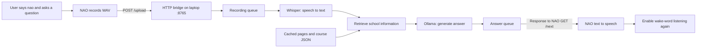

# Robot-NAO-V6

A Polish-speaking school information assistant built with a **NAO V6 robot**, **Choregraphe**, and local AI models running on a Windows laptop. Developed as a school internship and demonstration project for TEB in Gdańsk.

The robot handles microphones and speech output. The laptop transcribes questions, searches school information, and generates short answers. No paid cloud AI API is required.

**Status: working voice prototype; reliability improvements are still in progress.** Last documentation review: **24 September 2026**.

> Need to restore the robot or set it up without the original author? Follow [NAO setup and recovery](docs/NAO_SETUP.md). It includes the box scripts, exact connections, startup order, and checks.

## What works now

- Activate a question by saying **“nao”**.
- Record the question on the robot and upload it over the local network, including Wi-Fi.
- Transcribe Polish speech with **faster-whisper**, using the `small` model on the CPU.
- Find relevant school information using exact course-name matching or embeddings.
- Generate a short Polish answer with Ollama and speak it through NAO's `ALTextToSpeech`.
- Temporarily disable our wake-word subscription during the question/answer cycle and enable it again after speech finishes.
- Cache documents, embeddings, and downloaded models for later use.

The full voice loop has worked in manual tests. The latest pause/resume changes are present in the saved behavior, but still need repeat-cycle testing. Recording sometimes reaches its 15-second limit; recovery from empty transcriptions and network errors is not complete. See [Known limitations](#known-limitations).

## How it works



**STT** means speech-to-text. **TTS** means text-to-speech. **RAG** (retrieval-augmented generation) means finding source information before asking the language model to answer.

Whisper and Ollama run on the laptop, not on NAO. After the models and school data have been downloaded, the normal voice flow can run locally. Internet access is needed for initial installation, model downloads, and refreshing the web sources.

## Requirements

| Component | Current project setup |
| --- | --- |
| Robot | NAO V6 with a working Polish speech configuration |
| Robot editor | Choregraphe 2.8 and access to connect to the robot |
| Laptop | Windows, Python **3.12**; development used 3.12.9 |
| STT | `faster-whisper`, model `small`, `device="cpu"`, `compute_type="int8"`, language `pl` |
| Local LLM | Ollama: `qwen3:4b-instruct-2507-q4_K_M` |
| Embeddings | Ollama: `qwen3-embedding:0.6b` |
| Network | Robot can reach laptop TCP port `8765` |

The Choregraphe box scripts run in the robot's **Python 2.7** environment. Laptop scripts use **Python 3.12**. These are separate environments: do not run the robot box scripts in VS Code as standalone Python programs.

## Install the laptop software

Run commands in PowerShell from the repository root, the folder containing `Scripts` and this README. Replace the example path if necessary:

```powershell
cd C:\Users\admin1\Desktop\Robot-NAO-V6
py -3.12 --version
py -3.12 -m pip install ollama requests beautifulsoup4 faster-whisper
py -3.12 -m pip check
```

| Package | Purpose |
| --- | --- |
| `ollama` | Communicate with the local model service |
| `requests` | Download the school pages |
| `beautifulsoup4` | Extract text from HTML |
| `faster-whisper` | Transcribe audio; installs dependencies such as CTranslate2 |

This repository does not yet contain a verified dependency lock file. The installation command installs available package versions; it is not a promise of an identical historical environment. After validating a new installation, save its package versions with `py -3.12 -m pip freeze` for future recovery.

In VS Code, use **Ctrl+Shift+P → Python: Select Interpreter → Python 3.12**. Use the same interpreter for all laptop scripts and package installation. If `py` is unavailable, use the full path to your Python 3.12 executable with PowerShell's `&` operator.

An optional virtual environment can keep dependencies separate from other projects. It is not required for the commands above. If using one, select it in VS Code and use its `python` for every installation and run command.

Install [Ollama](https://ollama.com/) and download the two models:

```powershell
ollama pull qwen3:4b-instruct-2507-q4_K_M
ollama pull qwen3-embedding:0.6b
ollama list
```

Keep Ollama running. The code defaults to `http://127.0.0.1:11434`; an existing `OLLAMA_HOST` environment variable overrides that default.

Download/load the STT model once before the demonstration:

```powershell
py -3.12 -c "from faster_whisper import WhisperModel; WhisperModel('small', device='cpu', compute_type='int8'); print('STT model ready')"
```

The first load downloads model files. See the [faster-whisper installation documentation](https://github.com/SYSTRAN/faster-whisper) for dependency requirements.

## Start the assistant

1. Connect NAO and the laptop to a network where they can reach each other.
2. Start Ollama.
3. From the repository root, run:

   ```powershell
   py -3.12 Scripts\main.py
   ```

4. At `Update documents? (y/n):`, choose `n` to reuse cached pages or `y` to download them again. Embeddings are reused only when their model and chunks match the current data.
5. Wait for the bridge startup message and `Czekam na nagranie...` (waiting for a recording). Check that there is no server startup error.
6. Open the Choregraphe project, connect to NAO, and start the behavior as described in the [robot guide](docs/NAO_SETUP.md).
7. Say **“nao”**, pause about one second, then ask a Polish question. Finish speaking and wait for the answer.

There is **no typed `Ty:` question prompt or `exit` command in the current `main.py`**. Questions come from uploaded recordings. Stop the laptop application with **Ctrl+C** and stop the behavior in Choregraphe.

**Do not start `nao_bridge.py` separately while `main.py` is running.** The main application already starts the server in a background thread. Two processes cannot use the same port, and their queues would not be shared.

To test STT separately after a recording has been received:

```powershell
py -3.12 Scripts\test_speech.py
```

This transcribes the existing `work/question.wav`; it does not create a new recording.

## Files and responsibilities

| Path | Purpose |
| --- | --- |
| `Scripts/main.py` | Load data, start HTTP bridge, consume recordings, run STT/retrieval/LLM, queue answers |
| `Scripts/speech_to_text.py` | Load Whisper once and transcribe Polish audio |
| `Scripts/test_speech.py` | Transcribe the last saved WAV for a manual check |
| `Scripts/nao_bridge.py` | `POST /upload` receives WAV bytes; `GET /next` returns the next answer as JSON |
| `Scripts/llm.py` | Ollama model call and Polish answer instructions |
| `Scripts/retrieval.py` | Create/cache embeddings and search relevant chunks |
| `Scripts/similarity.py` | Cosine similarity calculation |
| `Scripts/scraper.py` | Download, clean, and split school pages |
| `Scripts/kierunki.json` | Course names and study variants; 83 courses were reported during development |
| `Scripts/documents.json` | Cached school documents |
| `Scripts/embeddings.json` | Generated embedding cache, ignored by Git |
| `NAO/nao/nao.pml` | Local Choregraphe project entry point; the whole `NAO/` folder is ignored by Git |
| `work/question.wav` | Last uploaded recording; overwritten on each upload and ignored by Git |
| `docs/NAO_SETUP.md` | Robot setup, recovery instructions, and dated copies of core box scripts |

## School data and answer generation

The configured sources are the [TEB Gdańsk contact page](https://szkolasrednia.teb.pl/miasta/d/gdansk/kontakt/) and [our school page](https://szkolasrednia.teb.pl/miasta/d/gdansk/nasza-szkola/), plus `Scripts/kierunki.json`.

For an exact course name, the application selects matching course chunks directly. Otherwise it retrieves up to three chunks using embeddings; some course-related words restrict the search to the course database. The LLM receives the question and selected context, with instructions to give short Polish answers and avoid inventing school facts. These instructions do not guarantee factual accuracy.

There is no conversation history in the current LLM call. Follow-up questions such as “and how much does it cost?” may lack enough context. Course prices are currently inserted as “no information”. Refreshing web documents does not update `kierunki.json`.

## Known limitations

- **Recording timeout:** silence detection uses a fixed microphone energy threshold of `600`. After the first qualifying sound, a `1.5 s` quiet interval stops recording; otherwise the hard limit is `15 s`. Room noise and quiet speech can prevent an early stop.
- **Empty transcription:** `main.py` skips it without sending a reply. Since wake-word listening resumes after speech output, the robot can remain waiting indefinitely.
- **Network recovery:** `Get answer` exits its polling loop after a URL error. An upload failure also has no signal to resume wake-word listening.
- **Recording cleanup:** failures around microphone start/stop are not fully handled. The “Already recording” error may recur.
- **STT quality:** Polish recognition can confuse similar words. A longer recording is not proof of better recognition.
- **Latency:** recording time, STT, retrieval, model loading, generation, and polling all contribute. The printed LLM answer time is not the complete interaction time.
- **Wake-word threshold:** `0.40` was chosen from a small manual test, not a broad evaluation. The built-in recognizer can return `nao` for other sounds with low confidence.
- **Data maintenance:** the contact scraper depends on page layout and text markers; recheck school/section assignments after refreshing sources.
- **Naming:** terminal messages still use “Tebit”, while the current LLM prompt calls the assistant “Gerald”. The activation word remains `nao`.
- **Animations:** a separate “six seven” animation was practised, but is not integrated into the voice loop or included in the core recovery setup.

These are open tasks, not completed fixes. For a demonstration, keep an operator available to stop and restart the behavior if necessary.

## Troubleshooting and recovery

For robot-specific errors, see the [diagnostic table](docs/NAO_SETUP.md#troubleshooting).

- **Missing Python module:** install it using the same Python 3.12 interpreter selected in VS Code.
- **CTranslate2 DLL error:** this is a library/runtime loading problem; changing the Whisper model size will not repair it. Follow the [CTranslate2 installation requirements](https://opennmt.net/CTranslate2/installation.html), including the Windows Visual C++ runtime requirement.
- **`computer_type` constructor error:** use the exact argument `compute_type="int8"`.
- **Port already in use:** close an older application or standalone bridge before restarting.
- **No audio file:** check the laptop IP, port, private-network firewall permission, and the Choregraphe upload log.

## Maintaining this project

For each change, update the relevant code, the status/limitations here, and the robot guide if box scripts or wires changed. Add a dated entry below with what changed, what was tested, and what remains open.

Keep a separate backup of the **entire `NAO/nao/` folder**, including `.pml`, behavior files, manifest, translations, and referenced media. A Git clone alone will not restore that ignored folder. The recovery guide can rebuild the three core voice boxes without it.

Do not commit voice recordings, model downloads, virtual environments, or embedding caches. Verify source data before publishing changes to school facts.

### Update log

| Date | Update | Validation / remaining work |
| --- | --- | --- |
| 2026-09-24 | Documentation updated for the integrated voice loop, Wi-Fi, Whisper `small`, wake word, and pause/resume wiring; added robot recovery guide | Source and wiring review; full voice loop previously demonstrated manually; timeout and failure recovery remain open |
