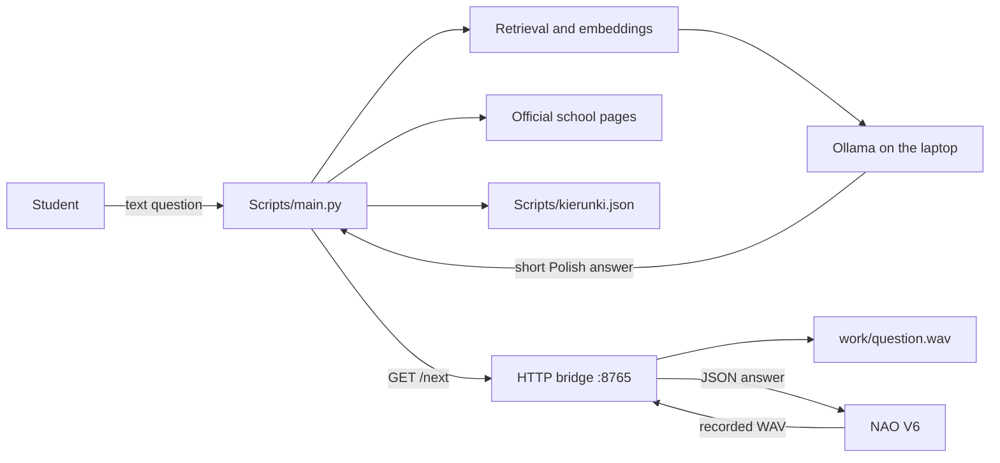

# Robot-NAO-V6

A local Polish-speaking information assistant for a NAO V6 robot. The assistant answers questions about TEB schools in Gdańsk using a small, local language model and a local school-information database.

The project is designed for a school internship and exhibition prototype. It is intentionally simple: the laptop does the data processing and AI work, while NAO is used for voice interaction and speech output.

## What the project does

The current system can:

- run the language model locally through Ollama;
- answer in Polish using a short, friendly style;
- answer greetings and simple questions about the robot;
- retrieve school facts from two official TEB pages;
- retrieve study-direction information from `Scripts/kierunki.json`;
- use cached documents and embeddings to make later starts faster;
- send generated answers to NAO over the local network;
- record audio on NAO and upload the WAV file to the laptop.

The voice recording is connected to the laptop, but speech-to-text is still a separate next step. At the moment, the text chat and audio-file transfer work independently.

The assistant is not intended to be a general-purpose chatbot. If the required fact is not in the supplied school data, it should say that it does not have the information.

## System overview



The laptop and NAO must be connected to the same local network. No cloud LLM API is required for the text assistant.

## Project structure

| Path | Purpose |
| --- | --- |
| `Scripts/main.py` | Main application. Loads data, prepares embeddings, starts the bridge, reads questions, retrieves context, and sends answers to NAO. |
| `Scripts/llm.py` | Calls the local Ollama chat model and contains the Polish assistant instructions. |
| `Scripts/retrieval.py` | Creates, saves, loads, and searches text embeddings. |
| `Scripts/similarity.py` | Calculates cosine similarity between two vectors. |
| `Scripts/scraper.py` | Downloads and cleans the two official TEB pages and splits them into searchable chunks. |
| `Scripts/nao_bridge.py` | Local HTTP server. It gives NAO queued answers through `/next` and accepts recorded WAV files through `/upload`. |
| `Scripts/kierunki.json` | Structured information about available study directions, study mode, required documents, and schedule. |
| `Scripts/documents.json` | Cached copy of the scraped school pages. It can be regenerated by the scraper and is currently stored in the repository. |
| `NAO/` | Local Choregraphe project files and NAO behavior files. This folder is ignored by Git in this repository. Copy it separately when transferring the robot setup. |
| `work/` | Local runtime files such as uploaded recordings. It is ignored by Git. |
| `.gitignore` | Keeps caches, recordings, virtual environments, and local NAO files out of the repository. |

## Requirements

### Hardware and software

- Windows laptop connected to the same network as the NAO V6 robot;
- Python 3.11 or newer;
- Ollama;
- Choregraphe 2.8 for the physical NAO behavior;
- internet access for the first installation and for refreshing the school pages.

After the models and caches are available, the text assistant can use local data without downloading an LLM response from the internet.

### Ollama models

This project currently uses:

```text
qwen3:4b-instruct-2507-q4_K_M
qwen3-embedding:0.6b
```

The first model generates the answer. The second model converts questions and school-information chunks into vectors for retrieval.

## Installation

Open PowerShell in the project folder:

```powershell
cd C:\Users\admin1\Desktop\Robot-NAO-V6
```

### 1. Create a virtual environment

```powershell
python -m venv .venv
.venv\Scripts\Activate.ps1
```

If `python` is not recognised, use the Python Launcher (`py`) or the full path to the Python executable installed on the laptop.

### 2. Install Python packages

```powershell
python -m pip install --upgrade pip
python -m pip install ollama requests beautifulsoup4
```

The packages are used for:

- `ollama` — communication with the local Ollama service;
- `requests` — downloading the school pages;
- `beautifulsoup4` — extracting readable text from HTML.

### 3. Install and start Ollama

Install Ollama from its official website, then download both models:

```powershell
ollama pull qwen3:4b-instruct-2507-q4_K_M
ollama pull qwen3-embedding:0.6b
```

Ollama normally runs as a local service on:

```text
http://127.0.0.1:11434
```

Check that it is available:

```powershell
ollama list
```

## Running the text assistant

Start Ollama first. Then, in the activated project environment, run:

```powershell
python Scripts\main.py
```

The program asks:

```text
Update documents? (y/n):
```

Choose:

- `y` — download the two configured school pages again and rebuild the document cache;
- `n` — use `Scripts/documents.json` and the existing embedding cache when they are valid.

The program then prints a prompt:

```text
Ty:
```

Enter a Polish question. Type `exit` to close the chat.

The first run can be slower because documents and embeddings are created. Later runs use `Scripts/documents.json` and `Scripts/embeddings.json` when the cached content still matches the current data and embedding model.

## School information sources

The scraper currently uses these official pages:

- [TEB Gdańsk contact page](https://szkolasrednia.teb.pl/miasta/d/gdansk/kontakt/)
- [TEB Gdańsk — our school](https://szkolasrednia.teb.pl/miasta/d/gdansk/nasza-szkola/)

Study directions are read from the local `Scripts/kierunki.json` file. The main program does not search the whole internet for study-direction answers. This makes the answers more predictable and keeps the exhibition version independent from changes on unrelated pages.

Prices are not included yet because they were not available in the current structured data. Do not add a price to the assistant until it is confirmed by the school source.

## How retrieval works

1. `scraper.py` downloads and cleans the configured pages.
2. `main.py` splits the text into overlapping chunks.
3. Each chunk receives an embedding from `qwen3-embedding:0.6b`.
4. The question receives one embedding.
5. `retrieval.py` compares the question vector with the chunk vectors using cosine similarity.
6. The best matching chunks are sent to `llm.py` as context.
7. The chat model generates a short Polish answer using only that context.

For an exact direction name, `main.py` first looks for the name directly in `Scripts/kierunki.json`. This is faster and more reliable than asking the embedding search to distinguish similar direction names.

## NAO and Choregraphe setup

The Choregraphe project is stored locally under `NAO/nao/`. It contains two important Python Script boxes:

### `Get answer`

This box repeatedly requests:

```text
http://<laptop-ip>:8765/next
```

The bridge returns JSON such as:

```json
{"text": "Cześć! Jestem Tebit."}
```

When the text is not empty, NAO speaks it through `ALTextToSpeech`. The box checks again after a short delay, so the behavior can speak several answers without being started again.

### `Record question`

This box uses NAO's `ALAudioRecorder` service. It records a WAV file temporarily on the robot at:

```text
/home/nao/question.wav
```

When recording stops, the box sends the file to:

```text
http://<laptop-ip>:8765/upload
```

The laptop saves the received bytes as:

```text
work\question.wav
```

This upload does not require the NAO file-transfer password because NAO sends the file to the laptop itself. The password is only needed when browsing or downloading files from the robot through Choregraphe.

### Network addresses

Replace the address in the Choregraphe scripts with the current laptop address. In the development setup, the laptop used `192.168.0.157` and the NAO used `192.168.0.143`. These addresses may change when the network changes.

The laptop server listens on all local interfaces:

```text
0.0.0.0:8765
```

The robot must be able to reach the laptop on TCP port `8765`. If Windows Firewall asks for permission, allow Python to communicate on the trusted private network.

### Recommended startup order

1. Connect NAO and the laptop to the same network.
2. Start Ollama.
3. Start `Scripts/main.py` on the laptop.
4. Open the Choregraphe project and connect to NAO.
5. Start the behavior containing `Get answer`.
6. Start the text chat and test a generated answer.
7. Test `Record question` separately until speech-to-text is connected.

Do not run `Scripts/nao_bridge.py` separately while `main.py` is running. `main.py` already starts the bridge, and starting a second server would cause a port conflict.

## Current status

### Working

- local Ollama chat model;
- Polish greeting and school-question behavior;
- two-site scraper with a local document cache;
- structured study-direction database;
- embedding cache and similarity search;
- exact study-direction matching;
- HTTP answer queue for NAO;
- NAO text-to-speech output;
- NAO recording upload to `work/question.wav`.

### Next development step

Add local speech-to-text on the laptop. The planned flow is:

```text
NAO recording → work/question.wav → local speech-to-text → main.py question → Ollama → NAO speech
```

The project should keep this step separate from the working text chat until the audio transcription has been tested.

## Troubleshooting

### `ollama` model not found

Check the model names and install them again:

```powershell
ollama list
ollama pull qwen3:4b-instruct-2507-q4_K_M
ollama pull qwen3-embedding:0.6b
```

### Port `8765` is already in use

Close an older `main.py` process or a separately started `nao_bridge.py`. Only one bridge should run.

### NAO says that recording has already started

Stop the current Choregraphe behavior before starting `Record question` again. The error means `ALAudioRecorder` is still busy with the previous recording.

### `question.wav` is not created

Check that:

- `main.py` is running;
- the laptop IP in the Choregraphe script is correct;
- NAO and the laptop are on the same network;
- Windows Firewall allows the local Python server;
- the Choregraphe log does not show an upload error.

### Answers are slow on the first run

The first run may load an Ollama model or create embeddings. Later runs should use the caches. Keep the embedding cache when the source data and embedding model have not changed.

## Updating the project

When new school information arrives:

1. Update `Scripts/kierunki.json` or the scraper input, depending on the source.
2. Run `python Scripts\main.py`.
3. Choose `y` when asked to refresh the website documents.
4. Test representative Polish questions.
5. Check that the answer uses the updated source and does not invent missing facts.
6. Commit only source code, JSON data, documentation, and required project files.

Do not commit:

- `work/` recordings;
- `Scripts/embeddings.json`;
- Python cache files;
- local virtual environments;
- private local NAO/Choregraphe files unless the team decides to distribute them separately.

## Development notes

The repository history contains the progression from a simple Ollama experiment to a retrieval-augmented assistant, then to a structured study-direction database and the NAO HTTP bridge. The README describes the current implementation; old experiments remain visible in Git history for learning and review.

When adding a feature, update three places:

1. the relevant source file;
2. the `Current status` or setup section in this README;
3. the troubleshooting section if the feature introduces a new failure mode.

This keeps the project understandable to another student or teacher who needs to set it up without the original developer.
