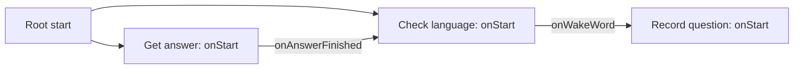

# NAO setup and recovery guide

This guide lets a teacher or another student rebuild the **core voice assistant** without the original author. It describes the project as saved on **24 September 2026**, including its known limitations. It does not claim that the prototype is ready for unattended operation.

Start with the laptop installation in [README.md](../README.md). This guide covers the robot side, its connection to the laptop, and recovery after losing the Choregraphe project or restarting the robot. It is not a firmware reset or reflashing guide.

## 1. Understand the two environments

| Runs on the laptop | Runs on NAO through Choregraphe |
| --- | --- |
| Python 3.12 application | Python 2.7 box scripts |
| Whisper speech recognition | `ALSpeechRecognition` for the activation word only |
| Ollama and school information retrieval | `ALAudioRecorder` and `ALAudioDevice` for recording |
| HTTP server on port 8765 | HTTP client using `urllib2` |
| Recording and answer queues | `ALTextToSpeech` for speaking answers |

The activation recognizer listens for `nao`; Whisper transcribes the actual question. They are different systems. Installing Whisper on the robot is not part of this setup.

The scripts below use Choregraphe's `GeneratedClass`, `self.session()`, and box outputs. They must be pasted into Python Script boxes, not run as laptop `.py` files.

## 2. Restore an existing project first

If a backup exists, copy the **complete `NAO/nao/` folder** to the laptop and open `nao.pml` in Choregraphe. Keep its manifest, `behavior_1`, translations, and media together. Copying only `behavior.xar` can lose referenced resources.

The repository ignores `/NAO/`. A Git clone therefore does not include the local project. The source snapshot later in this guide is intentionally stored outside that ignored folder so that the core behavior can still be rebuilt.

A robot restart does not mean that the laptop project has been lost. Reconnect and launch the saved behavior before attempting any wider recovery. No firmware reset is required for rebuilding these boxes.

## 3. Connect the network and check addresses

1. Connect the laptop and robot to a local network that allows device-to-device traffic. Wi-Fi works; a guest network may isolate devices.
2. In Choregraphe, use **Connection → Connect to** and choose the robot or enter its current IP address.
3. On the laptop, run `ipconfig` in PowerShell. Find the IPv4 address of the adapter used to communicate with NAO.
4. In the `Get answer` and `Record question` scripts, replace `192.168.0.157` with that **laptop** address.
5. Keep TCP port `8765` consistent with `Scripts/nao_bridge.py`. Allow Python through Windows Firewall on the trusted private network if needed; do not disable the firewall globally.

Development addresses were:

| Device | Historical example | Where it is used |
| --- | --- | --- |
| Laptop | `192.168.0.157` | Both HTTP URLs in the box scripts |
| Robot | `192.168.0.143` | Choregraphe connection target |

These are examples, not permanent addresses. Moving to Wi-Fi may change either address. The bridge binds to `0.0.0.0`, meaning all laptop interfaces; **do not use `0.0.0.0` as the robot's destination URL**.

The upload is sent by the robot itself. Normal recording transfer does not require browsing `/home/nao` with a file-transfer password. Existing robot connection permissions still apply; this is not a way to bypass authentication.

## 4. Prepare the robot

- Use Choregraphe 2.8 with the school's NAO V6 setup.
- Verify that Polish is available for speech recognition and speech output. The development robot listed Chinese, English, Japanese, and Polish for recognition.
- In the robot/application settings, use a supported language consistent with the behavior. The wake-word script explicitly selects `Polish`, but `Get answer` does not set the TTS language itself. Verify Polish pronunciation separately.
- Stop other test behaviors that use speech recognition, recording, or motion. For controlled development, disable Autonomous Life and allow the robot to finish any posture change. Autonomous motions previously interfered with manually posing the arms.
- Keep the robot in a stable position with clear space. The core voice setup does not need a walking or dance behavior.

If Choregraphe reports `ALAutonomousLife::switchFocus ... permission violation(s): language`, inspect the behavior's language requirements and the robot's configured/available languages. This is a behavior startup issue; editing Whisper or the HTTP bridge does not resolve it.

## 5. Rebuild the three core boxes

If there is no usable backup, create a new Choregraphe project. On the root diagram, create three **Python Script** boxes with these names:

1. `Check language` — historical name; now handles the wake word.
2. `Record question` — records and uploads the user's question.
3. `Get answer` — polls for answers and speaks them.

Open each box's script editor and replace the default script with its complete snapshot from section 10. Keep the generated `onStart`, `onStop`, and `onStopped` ports.

Add these custom outputs using **Edit box → plus beside Outputs**:

| Box | Output name (exact spelling) | Type | Nature |
| --- | --- | --- | --- |
| `Check language` | `onWakeWord` | Bang | Punctual |
| `Get answer` | `onAnswerFinished` | Bang | Punctual |

A **Bang** is a signal without a data payload. **Punctual** sends a signal without ending the box's work. Do not rename `onStopped` into a custom output. The Outputs dropdown selects an output to edit; it does not select which output will execute.

The output names must match the method calls `self.onWakeWord()` and `self.onAnswerFinished()` exactly. Choregraphe supplies these callable output methods.

## 6. Connect the boxes

Create these **four wires** on the root diagram:

| From | To | Why |
| --- | --- | --- |
| Root start, at the left edge | `Check language.onStart` | Start waiting for `nao` |
| Root start, at the left edge | `Get answer.onStart` | Start checking the answer queue |
| `Check language.onWakeWord` | `Record question.onStart` | Start one recording |
| `Get answer.onAnswerFinished` | `Check language.onStart` | Resume activation recognition after the answer |

Do not connect `Record question.onStopped` directly to `Check language.onStart`. Recording finishes before the model response and speech output; that connection would enable activation too early.



There is no wire from `Record question` to `Get answer`: the laptop's queues and HTTP requests carry the audio and answer. `Get answer` is already polling in a loop.

The inspected local project also starts `Tactile Head`, but its sensor outputs are disconnected. It is not required for this voice setup. The standalone `Animated Say` box and the lower animation chain are also not part of the core voice flow. Leave experimental animations disconnected from root start.

Save with **Ctrl+S**. Confirm that you are saving the same project that you will upload to the robot.

## 7. What happens during one question

1. `Check language` subscribes to `WordRecognized` and enables recognition of the vocabulary `['nao']` in Polish.
2. The callback requires the word `nao` and a confidence of at least `0.40`.
3. It sets `self.listening = False` and unsubscribes `TebitWakeWord` **before** sending `onWakeWord`.
4. `Record question` waits `0.5 s`, then records `/home/nao/question.wav` as 16 kHz WAV with channel selection `[0, 0, 1, 0]`.
5. Every `0.1 s`, it checks front microphone energy. A value greater than `600` marks sound and updates the last-sound time.
6. After sound was detected, `1.5 s` below the threshold ends the recording. The hard limit is `15 s`, including the wait for speech.
7. The robot stops recording and uploads WAV bytes to `POST /upload`.
8. The bridge saves the latest file as `work/question.wav` and queues its bytes. `main.py` consumes those bytes using `BytesIO`; it does not poll the file for changes.
9. Whisper transcribes the question. Retrieval selects school facts, and Ollama generates the answer.
10. `answers.put(answer)` queues the text. `Get answer` requests `/next` repeatedly, with a `0.5 s` sleep between iterations.
11. `self.tts.say(...)` speaks the text. After this synchronous call returns, `onAnswerFinished` re-enables wake-word listening if the box is still running.

`TebitWakeWord` is an arbitrary subscription identifier. It must match between `subscribe` and `unsubscribe`. It is **not** the phrase the user should pronounce.

This is a successful-cycle description. The current scripts do not recover correctly from all failures; see section 9.

## 8. Startup and acceptance check

1. Start Ollama and `py -3.12 Scripts\main.py` from the repository root.
2. Select `n` to use existing school documents. Wait for initialization, the bridge message, and `Czekam na nagranie...` without a server error.
3. Connect Choregraphe to NAO and press Run once.
4. Confirm `Czekam na slowo: nao` in the Choregraphe log.
5. Say `nao`, pause about one second, then ask `Kto jest dyrektorem liceum plastycznego?`.
6. Confirm `Wykryto nao`, recording logs, and the upload message.
7. In the laptop terminal, check `Rozpoznany tekst:` against what you actually said. Then check the generated answer.
8. Confirm that NAO speaks the answer **once** and remains out of wake-word listening while speaking.
9. After the answer, check that `Czekam na slowo: nao` appears again. Ask a second question using `nao`.
10. In a separate test, say unrelated phrases and observe false activations. Do not treat recognizer confidence as a literal percentage of correctness.

Record the result, room noise, approximate distance, and total response time. A connected robot or a successful single question is not a complete repeat-cycle test.

Stop both Choregraphe and the laptop program when finished. To clear queued old answers during troubleshooting, stop the behavior and restart `main.py` before starting the behavior again.

## 9. Troubleshooting

| Symptom | Current explanation / check | Action |
| --- | --- | --- |
| Records for all 15 seconds | No sound passed `600`, or background sound keeps resetting the silence timer | Compare `ZAPIS`/`GROMKO` logs during speech and silence before adjusting the threshold |
| Only `nao` was said; recording waits | The wake word was spoken before recording started; `heard_sound` remains false | Ask the question after activation; empty-recording handling still needs improvement |
| Stops responding after a silent/unclear question | `main.py` skips an empty transcription and no completion signal is returned | Restart the behavior for recovery; a proper failure/completion path is an open task |
| Answer appears on laptop but robot is silent | `Get answer` was not started, or its polling loop exited after a URL error | Check root-start wire and network log; fix connectivity and restart behavior |
| One brief Wi-Fi failure stops later speech | Current `Get answer` exits on `URLError`; it has no retry loop | Restore network and restart behavior |
| Upload error and no new wake-word listening | Upload exception is logged but does not re-enable recognition | Check IP/firewall/server, then restart behavior |
| Robot repeats an answer twice | Duplicate `self.tts.say` calls or another behavior speaking | Compare with the single call in the snapshot; run only one voice behavior |
| Robot starts a question from its own speech | Recognition was enabled too early, or another recognizer/behavior is active | Check unsubscribe before `onWakeWord`, and resume only after TTS finishes |
| `Already recording` | Recorder is still busy or cleanup failed | Stop all recording behaviors first; if the service remains stuck, use a normal robot restart and start one behavior only |
| Many identical word logs with different `behavior_...` IDs | Old event handlers may remain connected | Ensure `onUnload` disconnects `word_connection`; a normal restart cleared accumulated handlers during development |
| `['', -3.0]` in older logs | Empty recognition result, not a detected activation word | The current exact-word check rejects it; it does not by itself prove recognition stopped |
| No `Wykryto nao` | Language, vocabulary, threshold, subscription, or callback issue | Check the startup log and compare all three boxes with the snapshot |
| Hand returns to another pose while editing animation | Another behavior or Autonomous Life may control it | Stop behavior; disable Autonomous Life for manual posing |

### Open recovery defects

The code snapshot below preserves the current implementation, including these limitations:

- Empty transcription produces no reply and no resume signal.
- An upload failure does not resume the conversation.
- Polling stops on a URL error; errors while reading/parsing a response or speaking are not fully handled either.
- `self.recording` becomes true before microphone startup, and startup/stop exceptions do not have complete cleanup.
- Model/transcription failures in `main.py` can terminate processing without notifying the robot.
- `/next` removes an answer from its queue before delivery is confirmed. A dropped response can lose that answer.

Do not solve these by reconnecting wake-word listening immediately after upload. That would reintroduce activation while the robot is thinking or speaking. A future fix should give success, empty input, and error paths an explicit completion/recovery signal.

## 10. Core box script snapshot

Copied from the saved local `NAO/nao/behavior_1/behavior.xar` on 24 September 2026. This preserves the actual implementation rather than silently introducing untested fixes. Replace the laptop IP in both URLs before using it on a different network.

### Check language

```python
class MyClass(GeneratedClass):
    def __init__(self):
        GeneratedClass.__init__(self)

    def onLoad(self):
        self.speech = self.session().service("ALSpeechRecognition")
        self.listening = False

        self.memory = self.session().service("ALMemory")
        self.word_event = self.memory.subscriber("WordRecognized")
        self.word_connection = self.word_event.signal.connect(
            self.on_word_recognized
        )
        pass

    def onUnload(self):
        if self.listening:
            self.speech.unsubscribe("TebitWakeWord")
            self.listening = False

        if self.word_connection is not None:
            self.word_event.signal.disconnect(self.word_connection)
            self.word_connection = None

    def on_word_recognized(self, value):
        if not self.listening or not value or len(value) < 2:
            return

        word = value[0]
        confidence = value[1]

        if word == "nao" and confidence >= 0.40:
            # Ignore new activations until the answer has been spoken.
            self.listening = False
            self.speech.unsubscribe("TebitWakeWord")
            self.logger.info("Wykryto nao: " + str(confidence))
            self.onWakeWord()

    def onInput_onStart(self):
        if self.listening:
            return

        speech = self.session().service("ALSpeechRecognition")

        speech.pause(True)
        try:
            speech.setLanguage("Polish")
            speech.setVocabulary(["nao"], False)
        finally:
            speech.pause(False)

        self.speech.subscribe("TebitWakeWord")
        self.listening = True

        self.logger.info("Czekam na slowo: nao")
        # self.onStopped()  # Activate the box output.
        pass

    def onInput_onStop(self):
        self.onUnload()  # Reuse cleanup when the box stops.
        self.onStopped()  # Activate the box output.
```

### Record question

```python
import urllib2
import time

class MyClass(GeneratedClass):
    def __init__(self):
        GeneratedClass.__init__(self)

    def onLoad(self):
        self.recorder = self.session().service("ALAudioRecorder")
        self.audio = self.session().service("ALAudioDevice")
        self.audio.enableEnergyComputation()
        self.recording = False

    def onUnload(self):
        if self.recording:
            self.recording = False
            self.recorder.stopMicrophonesRecording()

    def onInput_onStart(self):
        if self.recording:
            return

        self.recording = True
        time.sleep(0.5)

        self.recorder.startMicrophonesRecording(
            "/home/nao/question.wav",
            "wav",
            16000,
            [0, 0, 1, 0],
        )

        started_at = time.time()
        last_sound_at = started_at
        heard_sound = False

        while self.recording:
            now = time.time()
            energy = self.audio.getFrontMicEnergy()
            self.logger.info("ZAPIS %.0f" % energy)

            if energy > 600:
                self.logger.info("GROMKO: %.0f" % energy)
                heard_sound = True
                last_sound_at = now

            # End on silence only after at least one sound passed the threshold.
            if heard_sound and now - last_sound_at >= 1.5:
                break

            # Limit the recording even if silence detection never triggers.
            if now - started_at >= 15:
                break

            time.sleep(0.1)

        if self.recording:
            self.onInput_onStop()

    def onInput_onStop(self):
        if not self.recording:
            return

        self.recording = False
        self.recorder.stopMicrophonesRecording()

        try:
            audio_file = open("/home/nao/question.wav", "rb")
            audio_data = audio_file.read()
            audio_file.close()

            request = urllib2.Request(
                "http://192.168.0.157:8765/upload",
                audio_data,
            )

            response = urllib2.urlopen(request, timeout=5)
            response.close()

            self.logger.info("Nagranie zostalo wylsane na komputer")

        except Exception as error:
            self.logger.error(str(error))

        self.onUnload()  # Reuse cleanup when the box stops.
        self.onStopped()  # Activate the box output.
```

### Get answer

```python
import urllib2
import json
import time

class MyClass(GeneratedClass):
    def __init__(self):
        GeneratedClass.__init__(self)

    def onLoad(self):
        self.tts = self.session().service("ALTextToSpeech")
        self.running = False

    def onUnload(self):
        self.running = False

    def onInput_onStart(self):
        if self.running:
            return

        self.running = True

        while self.running:
            try:
                response = urllib2.urlopen(
                    "http://192.168.0.157:8765/next",
                    timeout=5,
                )
            except urllib2.URLError as error:
                self.logger.error(str(error))
                self.running = False
                break

            try:
                raw_data = response.read()
            finally:
                response.close()

            decoded_data = raw_data.decode("utf-8")
            data = json.loads(decoded_data)
            text = data.get("text", "")

            self.logger.info(text.encode("utf-8"))

            if text and self.running:
                # This call returns after speech finishes.
                self.tts.say(text.encode("utf-8"))
                if self.running:
                    self.onAnswerFinished()

            time.sleep(0.5)
        self.onStopped()

    def onInput_onStop(self):
        self.onUnload()
```

## 11. Keep the recovery material current

After changing a box:

1. Save the Choregraphe project.
2. Update its script snapshot here and the port/wiring tables if necessary.
3. Test two complete questions in sequence, an empty question, and recovery after a connection failure.
4. Record what passed and what is still broken.
5. Back up the entire local project folder separately from Git.

Suggested maintenance record:

| Date | Change | Robot/NAOqi and Choregraphe versions | Test result | Remaining issue |
| --- | --- | --- | --- | --- |
| 2026-09-24 | Core scripts and voice wiring documented | NAO V6; Choregraphe 2.8; exact NAOqi build not recorded | Static source/wiring review; earlier manual voice tests succeeded | 15-second recordings and failure recovery need further work |

Also record the laptop IP, Python/package versions, model names, and backup location when preparing a new installation. Never store passwords or private recordings in this document.

## References

- [Choregraphe Python boxes](https://app.osrw.de/NAO/aldeb-doc-2.8.7.4/software/choregraphe/objects/python_box.html)
- [Choregraphe inputs and outputs](https://www.arabicrobotics.com/Aldebaran/aldeb-doc-2.5.7.1/software/choregraphe/objects/box_input_output.html)
- [ALSpeechRecognition](https://app.osrw.de/NAO/aldeb-doc-2.8.7.4/naoqi/audio/alspeechrecognition.html)
- [Timeline documentation](https://app.osrw.de/NAO/aldeb-doc-2.8.7.4/software/choregraphe/panels/timeline_panel.html)

The project-specific values and scripts in this guide come from the repository and the saved local behavior. Vendor documentation explains the underlying tools; it does not certify this prototype.
